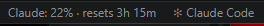

# ClaudePulse

Ambient Claude Code quota visibility in the VS Code status bar. No modals, no navigation — just a persistent, at-a-glance display of your current usage window.

## Features

- **Status bar item** showing your pinned metric at all times
- **Color-coded utilization** — yellow at 50%, red at 80%
- **Hover tooltip** with the full breakdown across all windows
- **Click to switch** which metric is pinned, or trigger an immediate refresh



## Requirements

[Claude Code](https://claude.ai/code) must be installed and authenticated. ClaudePulse reads your existing credentials from `~/.claude/.credentials.json` — no separate API key or login required.

## Usage

ClaudePulse activates automatically when VS Code starts. The status bar item appears in the bottom-left corner.

**Status bar display:**
```
Claude: 73% · resets 1h 22m      ← 5h or 7-day window
Claude: $7.42 / $100.00           ← extra usage credits
```

**Click the status bar item** to open the usage picker:

```
$(pulse)       5h window    73% · resets 1h 22m
$(calendar)    7-day        41% · resets 6d 14h
$(credit-card) Extra usage  $7.42 / $100.00
──────────────────────────────────────────
$(refresh)     Refresh now
```

Select any metric row to pin it to the status bar. Select **Refresh now** to poll immediately without waiting for the next interval.

## Configuration

| Setting | Type | Default | Description |
|---------|------|---------|-------------|
| `claudePulse.pollIntervalMinutes` | number | `5` | Poll interval in minutes. Minimum enforced at 5. |
| `claudePulse.pinnedMetric` | enum | `fiveHour` | Metric shown in the status bar: `fiveHour`, `sevenDay`, or `extraUsage`. |

`pinnedMetric` is also writable directly from the status bar click menu — you never need to open Settings manually.

## How It Works

ClaudePulse polls `https://api.anthropic.com/api/oauth/usage` using the Bearer token that Claude Code maintains in `~/.claude/.credentials.json`. The token is read fresh on each poll so it stays current without any refresh logic on our side. No data leaves your machine beyond the Anthropic API call itself.

## Privacy

- Reads one file on disk: `~/.claude/.credentials.json`
- Makes one HTTPS request per poll interval: `GET api.anthropic.com/api/oauth/usage`
- No telemetry, no analytics, no external services

## License

MIT
